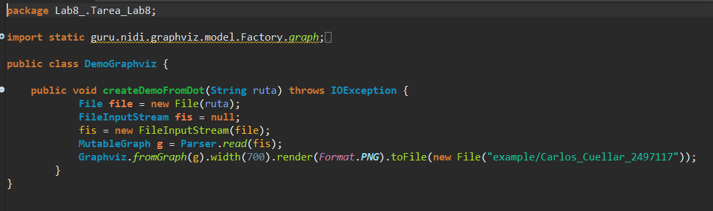
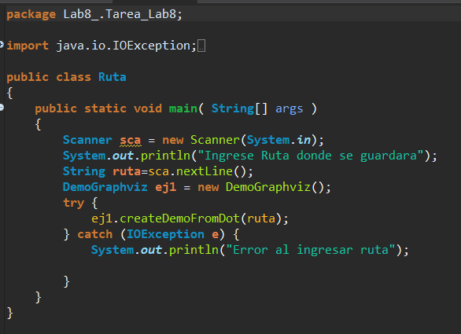

# Laboratorio 8

### Carlos Andrés Cuéllar Velásquez 2497117
       
## a) Bitácora

1.  Class DemoGraphviz.

      1.1 Se crea createDemoFromDot con parametro String para que pueda obtener la Ruta que sera solicitada.
   
      1.2 Dentro se declara un objeto archivo que es donde se guardara la ruta.
   
      1.3 Se especifica como sera la estructura a graficar.

 

2.  Class Ruta.

      2.1 Se importa libreria scanner y se le solicita la ruta al usuario. 
   
      2.2 Se guarda el dato ingresado por el usuario que sera enviado como parametro al metodo en la clase DemoGraphviz.
   
      2.3 Se crea un Try Catch por si el usuario ingresa mal la direccion donde se guardara.

 
